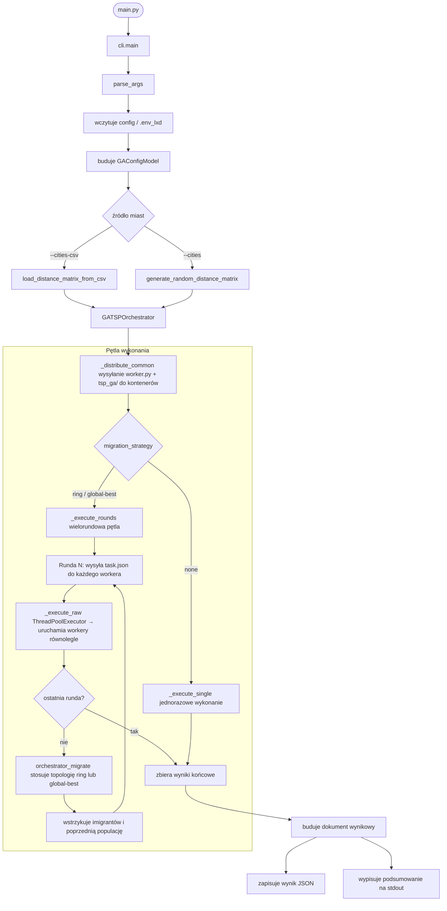
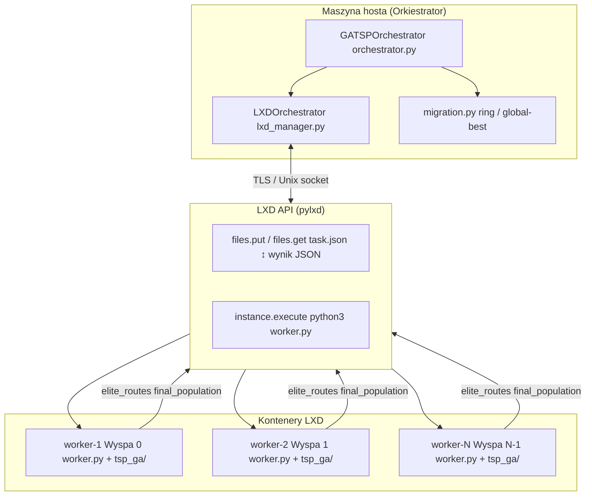
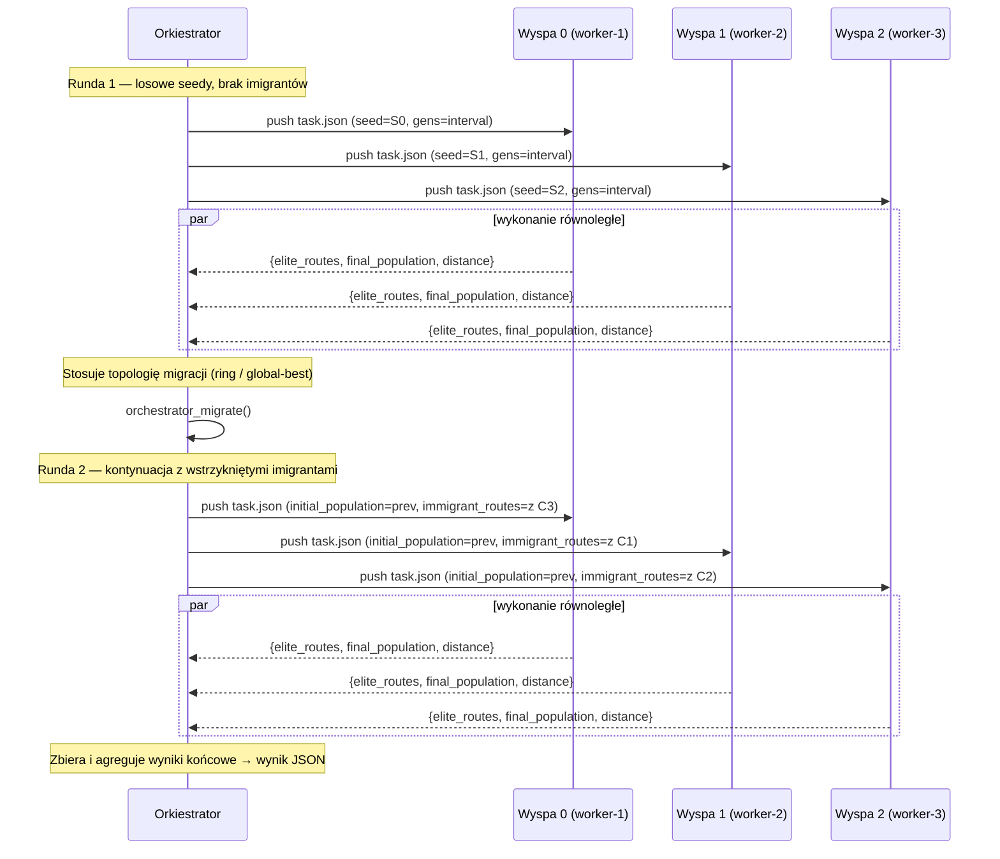
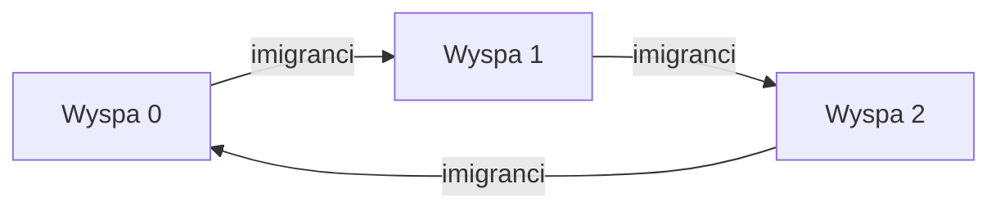
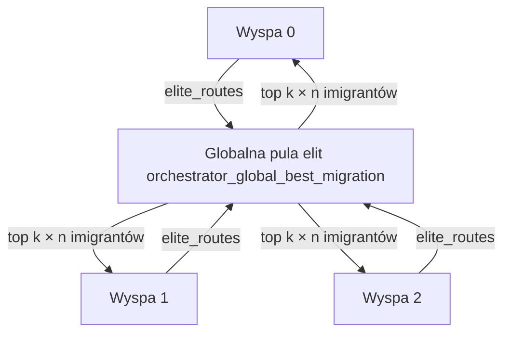

# LXD Native — Rozproszony Orkiestrator Algorytmu Genetycznego TSP

Rozproszony wyspowy algorytm genetyczny dla problemu komiwojażera (TSP), orkiestrowany natywnie przez kontenery LXD za pomocą API **pylxd**.

```text
1 kontener LXD = 1 wyspa GA = 1 niezależny proces workera
```

Orkiestrator działa na maszynie hosta, dystrybuuje zadania TSP do kontenerów, zbiera wyniki i zarządza migracją między wyspami pomiędzy rundami. LXD dostarcza izolowane środowiska wykonawcze; dystrybucja zadań i migracja są realizowane w całości przez orkiestrator Pythona.

---

## Przepływ pipeline



---

## Schemat aplikacji



---

## Przepływ rund wyspy GA



---

## Strategie migracji

Program obsługuje trzy strategie migracji:

```text
none         brak migracji; wyspy ewoluują niezależnie z unikalnymi seedami
ring         topologia pierścieniowa: wyspa[i] otrzymuje elity z wyspa[(i-1) % n]
global-best  każda wyspa otrzymuje top-k elity z puli wszystkich wysp
```

### `ring`



Każda wyspa wysyła swoje najlepsze trasy do następnej wyspy w pierścieniu. Koszt komunikacji to O(k) na wyspę, gdzie k = `--immigrants`.

### `global-best`



Wszystkie wyspy dzielą swoje elity przez orkiestratora. Każda wyspa otrzymuje tę samą globalną pulę top-k. Wyższy koszt komunikacji niż `ring`, ale szybsza zbieżność.

---

## Struktura projektu

```text
lxd_native/
├── main.py                   # Cienki entrypoint → cli.main()
├── cli.py                    # Parsowanie argumentów, rozwiązywanie priorytetów konfiguracji
├── orchestrator.py           # GATSPOrchestrator — główna logika wykonania
├── lxd_manager.py            # LXDClient + LXDOrchestrator (wrappery pylxd)
├── requirements.txt
├── script.sh
├── config/
│   ├── config.py             # Ustawienia klastra, macierz odległości, loader .env_lxd
│   └── ga_config_model.py    # Pydantic GAConfigModel — walidowane parametry GA
├── container/
│   ├── worker.py             # Entrypoint wyspy wykonywany wewnątrz każdego kontenera
│   └── tsp_ga/
│       ├── evolution.py      # Pętla ewolucji jednej generacji
│       ├── models.py         # Modele danych (GAConfig, Problem, Individual)
│       ├── operators.py      # Selekcja, crossover, mutacja, 2-opt delta O(1)
│       ├── runner.py         # run_island() — napędza GA dla jednej wyspy
│       └── timing.py         # Narzędzie StageTimer
├── tsp_ga/
│   └── migration.py          # orchestrator_migrate, funkcje ring i global-best
└── utils/
    └── config_utils.py       # Loader CSV, generator losowej macierzy, DistanceMatrix
```

---

## Moduły

| Plik                            | Odpowiedzialność                                                                                  |
| ------------------------------- | ------------------------------------------------------------------------------------------------- |
| `main.py`                       | Cienki entrypoint; deleguje do `cli.main()`                                                       |
| `cli.py`                        | Parsowanie argumentów CLI; priorytet konfiguracji: domyślne < plik JSON < jawne flagi             |
| `orchestrator.py`               | `GATSPOrchestrator`: dystrybuuje zadania, uruchamia rundy, zbiera wyniki                          |
| `lxd_manager.py`                | `LXDClient` (bezpieczny wątkowo wrapper pylxd) + `LXDOrchestrator` (cykl życia, push, execute)    |
| `config/config.py`              | Wczytuje `.env_lxd`, eksponuje stałe klastra, buduje `DistanceMatrix`                             |
| `config/ga_config_model.py`     | Model Pydantic wszystkich parametrów GA z walidacją krzyżową pól                                  |
| `container/worker.py`           | Entrypoint wyspy: wczytuje `task.json`, uruchamia GA, wypisuje wynik JSON na stdout               |
| `container/tsp_ga/models.py`    | Typy danych: `GAConfig`, `Problem`, `Individual`; brak zależności od pylxd                        |
| `container/tsp_ga/operators.py` | Selekcja turniejowa, order crossover, mutacja swap, losowy 2-opt delta O(1)                       |
| `container/tsp_ga/evolution.py` | `evolve_one_generation()` z elitarnością przez `heapq.nsmallest`                                  |
| `container/tsp_ga/runner.py`    | `run_island()` — główna pętla GA dla jednej wyspy                                                 |
| `container/tsp_ga/timing.py`    | `StageTimer` do pomiaru etapów wykonania                                                          |
| `tsp_ga/migration.py`           | `orchestrator_ring_migration()`, `orchestrator_global_best_migration()`, `orchestrator_migrate()` |
| `utils/config_utils.py`         | `DistanceMatrix`, loader CSV, generator losowej macierzy                                          |

---

## Pierwszeństwo konfiguracji

```text
1. Wartości domyślne wbudowane   (GAConfigModel / config.py)
2. Plik konfiguracyjny JSON      (--config ścieżka/do/config.json)
3. Jawne flagi CLI               (zawsze nadpisują)
```

---

## Instalacja

### Maszyna hosta

```bash
python3 -m venv .venv
source .venv/bin/activate
pip install -r requirements.txt
```

### Kontenery LXD

Na każdym kontenerze używanym jako worker:

```bash
sudo apt update
sudo apt install -y python3 python3-pip python3-venv
```

Orkiestrator automatycznie przesyła `worker.py` i pakiet `tsp_ga/` do każdego kontenera przed wykonaniem. Ręczna instalacja w kontenerach nie jest wymagana.

### Plik środowiskowy

Utwórz `.env_lxd` w katalogu głównym projektu:

```ini
LXD_ENDPOINT=https://twoj-host-lxd:8443
LXD_CERT=/ścieżka/do/client.crt
LXD_KEY=/ścieżka/do/client.key
LXD_CA=/ścieżka/do/server.ca
LXD_CONCURRENCY=6
```

Pozostaw `LXD_ENDPOINT` puste, aby użyć lokalnego socketu Unix.

---

## Uruchomienie

```bash
python3 main.py --help
```

### Bez migracji (linia bazowa)

```bash
python3 main.py \
  --workers worker-1,worker-2,worker-3 \
  --cities 50 \
  --population 100 \
  --generations 500 \
  --migration-strategy none \
  --output results/baseline.json \
  --metadata-run-id run-001 \
  --metadata-scenario-name 3-wyspy-bez-migracji
```

### Migracja pierścieniowa (ring)

```bash
python3 main.py \
  --workers worker-1,worker-2,worker-3 \
  --cities 100 \
  --population 150 \
  --generations 1000 \
  --migration-strategy ring \
  --migration-interval 50 \
  --immigrants 3 \
  --output results/ring-run.json \
  --metadata-run-id run-002 \
  --metadata-scenario-name 3-wyspy-ring
```

### Migracja globalnie najlepszych (global-best)

```bash
python3 main.py \
  --workers worker-1,worker-2,worker-3 \
  --cities 100 \
  --population 150 \
  --generations 1000 \
  --migration-strategy global-best \
  --migration-interval 100 \
  --immigrants 1 \
  --output results/global-best-run.json \
  --metadata-run-id run-003 \
  --metadata-scenario-name 3-wyspy-global-best
```

### Z pliku CSV z miastami

```bash
python3 main.py \
  --workers worker-1,worker-2 \
  --cities-csv data/cities.csv \
  --population 200 \
  --generations 2000 \
  --migration-strategy ring \
  --migration-interval 50 \
  --immigrants 2 \
  --output results/csv-run.json
```

---

## Parametry CLI

| Parametr                         | Znaczenie                                                              |
| -------------------------------- | ---------------------------------------------------------------------- |
| `--workers`                      | Lista nazw kontenerów LXD oddzielona przecinkami                       |
| `--concurrency`                  | Maks. liczba równoległych operacji LXD (domyślnie z `LXD_CONCURRENCY`) |
| `--cities`                       | Liczba losowo generowanych miast                                       |
| `--cities-csv`                   | Plik CSV ze współrzędnymi miast                                        |
| `--cities-seed`                  | Ziarno RNG do generowania losowych miast                               |
| `--population`                   | Rozmiar populacji na wyspę                                             |
| `--generations`                  | Łączna liczba generacji na wyspę                                       |
| `--mutation`                     | Prawdopodobieństwo mutacji swap                                        |
| `--elite`                        | Liczba elitarnych osobników przenoszonych do kolejnej generacji        |
| `--tournament`                   | Rozmiar turnieju w selekcji turniejowej                                |
| `--two-opt-attempts`             | Liczba losowych prób lokalnego ulepszenia 2-opt na osobnika            |
| `--seed`                         | Bazowe ziarno RNG (ziarna per wyspa są z niego wyprowadzane)           |
| `--migration-strategy`           | `none` / `ring` / `global-best`                                        |
| `--migration-interval`           | Liczba generacji na rundę przed migracją                               |
| `--immigrants`                   | Liczba elitarnych tras migrujących na wyspę                            |
| `--output`                       | Wymagana ścieżka zapisu wyniku JSON                                    |
| `--report-interval`              | Interwał generacji dla raportowania postępu                            |
| `--debug-routes`                 | Walidacja, czy trasy są poprawnymi permutacjami (do rozwoju)           |
| `--cleanup`                      | Usuń pliki workera z kontenerów po wykonaniu                           |
| `--config`                       | Ścieżka do pliku konfiguracyjnego JSON                                 |
| `--metadata-run-id`              | Identyfikator uruchomienia eksperymentu zapisany w JSON wynikowym      |
| `--metadata-scenario-name`       | Nazwa scenariusza zapisana w JSON wynikowym                            |
| `--metadata-containers-per-node` | Liczba kontenerów na fizyczny węzeł (metadane)                         |
| `--metadata-cpu-limit`           | Limit CPU ustawiony na kontenerach LXD (metadane)                      |
| `--metadata-code-version`        | Wersja kodu / commit / tag (metadane)                                  |

---

## Wynik programu

Orkiestrator zawsze zapisuje pełny wynik do `--output`. Na stdout wypisywana jest krótka tabela podsumowania pokazująca globalny wynik, optymalną trase, podsumowania od wysp oraz metryki czasowe faz

```text
================ GLOBALNY NAJLEPSZY WYNIK ================
ID uruchomienia    : manual-run
Znalazł kontener   : worker-1
Najkrótszy dystans : 1755.8414
Optymalna trasa    : Płońsk -> Sochocin -> Nowe Miasto -> Pułtusk -> Maków Mazowiecki -> Różan -> Ostrołęka -> Myszyniec -> Chorzele -> Przasnysz -> Ciechanów -> Mława -> Lubowidz -> Żuromin -> Bieżuń -> Sierpc -> Glinojeck -> Raciąż -> Drobin -> Staroźreby -> Płock -> Gostynin -> Gąbin -> Sanniki -> Bodzanów -> Wyszogród -> Czerwińsk nad Wisłą -> Zakroczym -> Nowy Dwór Mazowiecki -> Legionowo -> Łomianki -> Warszawa -> Piastów -> Ożarów Mazowiecki -> Pruszków -> Brwinów -> Podkowa Leśna -> Milanówek -> Grodzisk Mazowiecki -> Błonie -> Sochaczew -> Wiskitki -> Żyrardów -> Mszczonów -> Tarczyn -> Piaseczno -> Konstancin-Jeziorna -> Góra Kalwaria -> Karczew -> Otwock -> Józefów -> Sulejówek -> Halinów -> Stanisławów -> Dobre -> Mińsk Mazowiecki -> Siennica -> Cegłów -> Kałuszyn -> Mrozy -> Latowicz -> Garwolin -> Pilawa -> Osieck -> Magnuszew -> Warka -> Grójec -> Mogielnica -> Nowe Miasto nad Pilicą -> Odrzywół -> Gielniów -> Przysucha -> Szydłowiec -> Jastrząb -> Przytyk -> Wyśmierzyce -> Białobrzegi -> Głowaczów -> Jedlnia-Letnisko -> Radom -> Skaryszew -> Iłża -> Sienno -> Solec nad Wisłą -> Lipsko -> Ciepielów -> Kazanów -> Zwoleń -> Pionki -> Kozienice -> Maciejowice -> Łaskarzew -> Żelechów -> Siedlce -> Mordy -> Łosice -> Sokołów Podlaski -> Węgrów -> Kosów Lacki -> Małkinia Górna -> Ostrów Mazowiecka -> Brok -> Łochów -> Jadów -> Wyszków -> Tłuszcz -> Wołomin -> Kobyłka -> Zielonka -> Ząbki -> Marki -> Radzymin -> Serock -> Nasielsk
──────────────── Podsumowanie wysp ──────────────────────────
Liczba wysp        : 3
Strategia migracji : ring
Liczba miast       : 114
Dystans min/śr/max : 1755.84 / 1755.84 / 1755.84
Unikalne trasy     : 1
Różnorodność kraw. : 0.0000 (śr)
──────────────── Czasy faz ──────────────────────────────────
Prowizjonowanie  : 0.72s
Przesyłanie kodu : 0.58s
Wykonanie GA     : 26.37s
Łącznie          : 27.68s
==============================================================
```

Pełna struktura dokumentu JSON:

```text
metadata
  run_id                        identyfikator uruchomienia
  scenario_name                 nazwa scenariusza
  worker_count                  liczba wysp (kontenerów)
  cities                        liczba miast
  migration_strategy            zastosowana strategia migracji
  elapsed_seconds               łączny czas wykonania
  phase_timings
    provision_seconds           czas przygotowania kontenerów
    distribute_seconds          czas przesyłania kodu do kontenerów
    execute_seconds             czas wykonania GA (wszystkie rundy)
    total_seconds               suma wszystkich faz

ga_config                       kopia efektywnej konfiguracji GA

summary
  best_distance                 dystans najlepszej trasy (globalnie)
  best_worker_id                wyspa, która znalazła najlepszą trasę
  best_path                     sekwencja miast najlepszej trasy
  min_distance                  minimum dystansów spośród wysp
  mean_distance                 średnia dystansów spośród wysp
  max_distance                  maksimum dystansów spośród wysp

diversity                       metryki różnorodności (opis poniżej)

islands[]                       wyniki per wyspa (opis poniżej)

metadata{}                      przekazane metadane eksperymentu
```

---

## Metryki czasu

Wynik JSON zawiera sekcję `phase_timings` dzielącą łączny czas na fazy:

| Pole                 | Znaczenie                                                      |
| -------------------- | -------------------------------------------------------------- |
| `provision_seconds`  | Czas przygotowania i uruchomienia kontenerów LXD               |
| `distribute_seconds` | Czas przesyłania `worker.py` i pakietu `tsp_ga/` do kontenerów |
| `execute_seconds`    | Czas wykonania GA — obejmuje wszystkie rundy i migracje        |
| `total_seconds`      | Suma wszystkich faz (równa `elapsed_seconds` w `metadata`)     |

Sekcja `islands[]` zawiera per-wyspę:

| Pole                     | Znaczenie                                                    |
| ------------------------ | ------------------------------------------------------------ |
| `elapsed_seconds`        | Łączny czas pracy wyspy (GA + migracja)                      |
| `evolution_time_seconds` | Czas poświęcony wyłącznie na ewolucję (bez narzutu migracji) |
| `migration_count`        | Liczba przeprowadzonych rund migracji na tej wyspie          |

Różnica `elapsed_seconds - evolution_time_seconds` przybliża narzut komunikacyjny (przesyłanie pliku, parsowanie JSON, uruchamianie procesu w kontenerze).

---

## Metryki różnorodności

Sekcja `diversity` w wyniku JSON opisuje podobieństwo najlepszych tras znalezionych przez poszczególne wyspy.

Trasa TSP jest zamieniana na zbiór nieskierowanych krawędzi cyklu. Odległość między dwiema trasami jest liczona jako:

```text
edge_distance = 1 - |wspólne krawędzie| / max(|krawędzie A|, |krawędzie B|)
```

Interpretacja:

```text
0.0  najlepsze trasy mają identyczny zbiór krawędzi (wyspy zbiegły się do tego samego rozwiązania)
1.0  najlepsze trasy nie mają żadnych wspólnych krawędzi (wyspy przeszukują całkowicie różne obszary)
```

| Pole                          | Znaczenie                                                       |
| ----------------------------- | --------------------------------------------------------------- |
| `unique_best_routes`          | Liczba unikalnych najlepszych tras spośród wszystkich wysp      |
| `pairwise_comparisons`        | Liczba porównanych par tras (kombinacje wysp)                   |
| `mean_pairwise_edge_distance` | Średnia odległość krawędziowa między parami najlepszych tras    |
| `min_pairwise_edge_distance`  | Minimalna odległość krawędziowa (najbardziej podobna para wysp) |
| `max_pairwise_edge_distance`  | Maksymalna odległość krawędziowa (najbardziej różna para wysp)  |

Metryka jest szczególnie przydatna do porównania efektu strategii migracji:

- `none` — wyspy ewoluują niezależnie; wysoka różnorodność, brak presji na zbieżność
- `ring` — migracja pierścieniowa stopniowo propaguje dobre geny; umiarkowana zbieżność
- `global-best` — agresywna migracja elit; szybsza zbieżność, ale ryzyko przedwczesnego ujednolicenia wysp (niska różnorodność)

### Historia zbieżności

Każda wyspa w sekcji `islands[]` zawiera pole `history` — listę par `[generacja, dystans]` próbkowanych co `--report-interval` generacji. Pozwala to śledzić krzywą zbieżności każdej wyspy niezależnie i porównywać tempo poprawy między strategiami migracji.

---

## Optymalizacje złożoności obliczeniowej

### Losowy 2-opt z oceną delta O(1)

`random_two_opt_improvement()` nie przelicza całej długości trasy po każdej próbie. Liczy zmianę kosztu tylko dla czterech krawędzi:

```text
stare krawędzie: (a,b), (c,d)
nowe krawędzie:  (a,c), (b,d)
```

Koszt pojedynczej próby 2-opt to O(1); pary sąsiadujące są pomijane.

### `heapq.nsmallest` do wyboru elity i imigrantów

```python
heapq.nsmallest(k, population, key=lambda ind: ind.distance)
```

Dla małego k ogranicza to koszt z pełnego sortowania O(n log n) do ~O(n log k).

---

## Uwagi projektowe

- Workery otrzymują unikalne seedy per wyspa (`base + idx * 997`), dzięki czemu każda wyspa przeszukuje inny obszar przestrzeni rozwiązań niezależnie.
- Seedy wielorundowe są dodatkowo zróżnicowane: `base + runda * 100_003 + idx * 997`, aby zapobiec kolizjom seedów między rundami.
- `models.py` wewnątrz pakietu kontenera nie ma zależności od pylxd, dzięki czemu logikę GA można testować jednostkowo bez demona LXD.
- Migracja jest sterowana przez orkiestratora: workery są procesami bezstanowymi; cała logika topologii żyje w `tsp_ga/migration.py` na hoście.
- `--debug-routes` włącza walidację permutacji O(n) przez `collections.Counter`. Wyłącz przy dłuższych benchmarkach.
- Wrapper `LXDClient` instaluje filtr `threading.excepthook`, który wycisza niegroźny błąd ws4py `"closed epoll object"` na Pythonie 3.14+.
